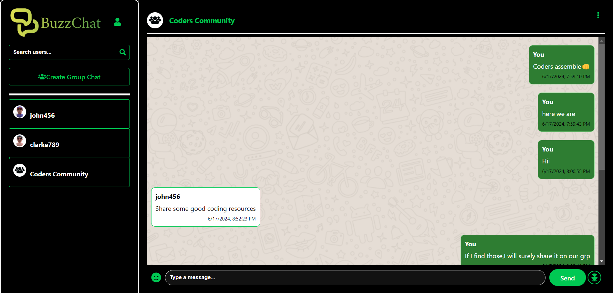
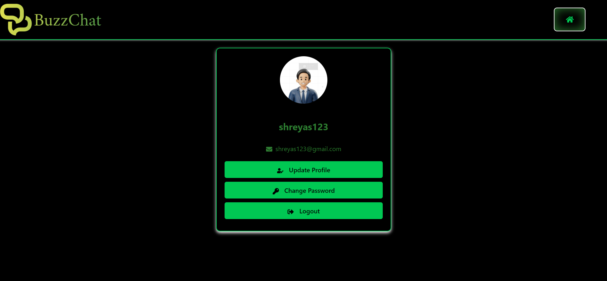
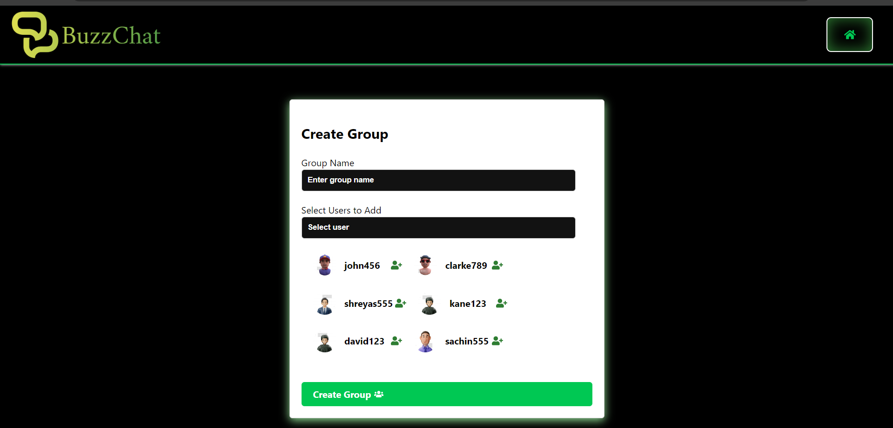
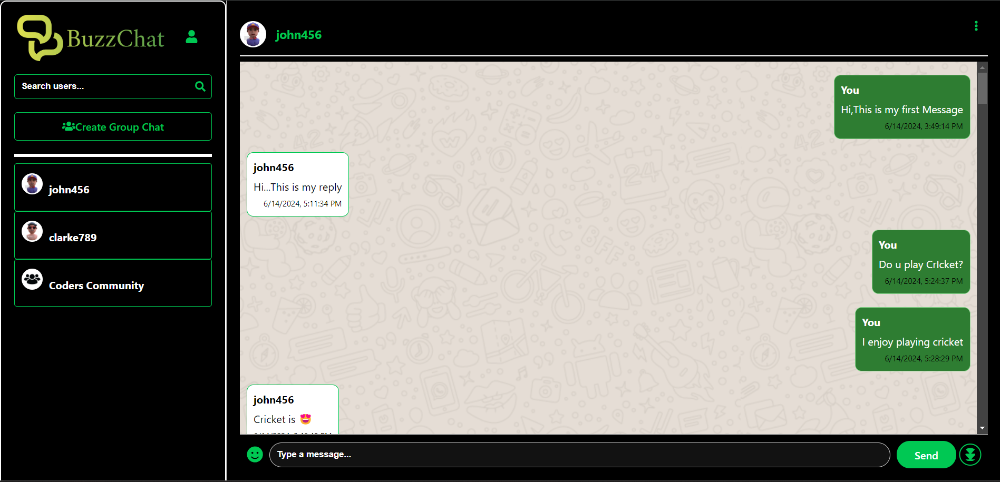
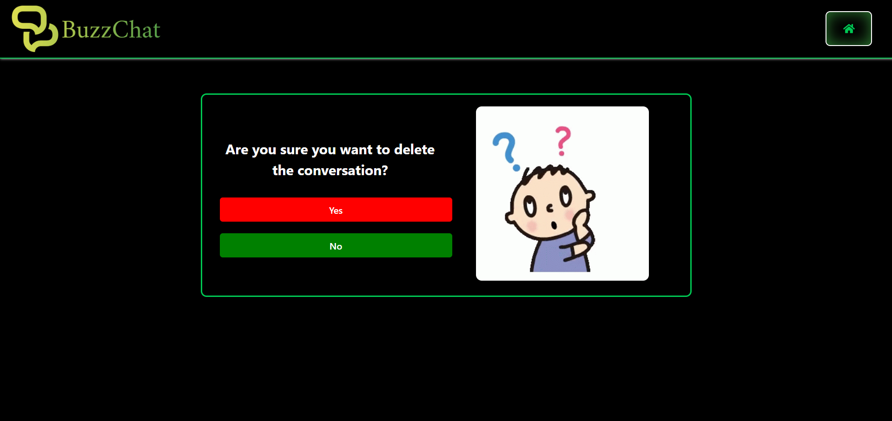
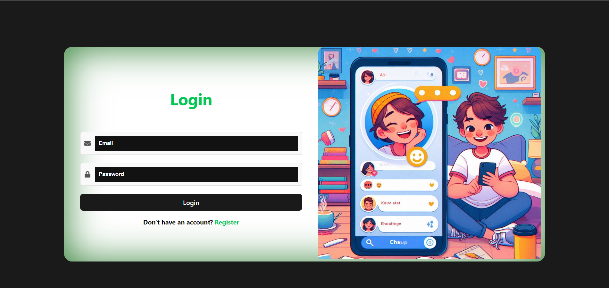
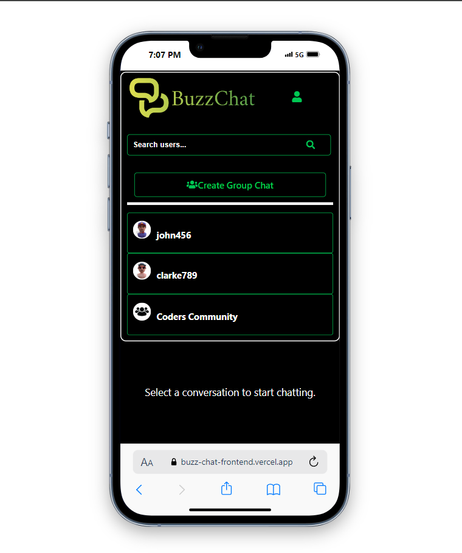
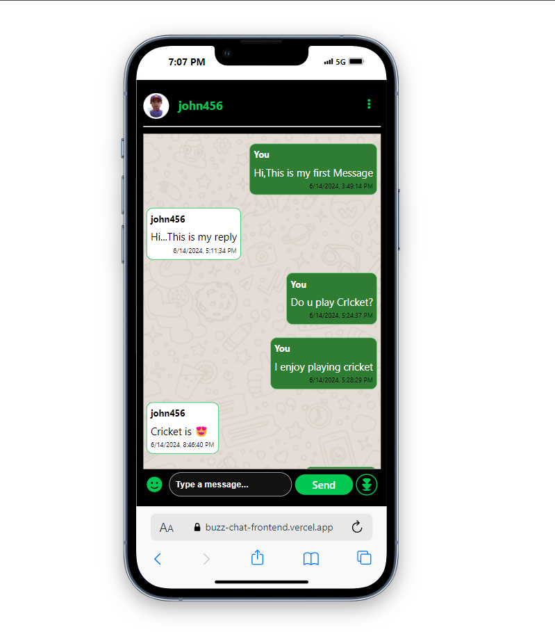

# BuzzChat

BuzzChat is a real-time chat app built with MERN and Socket.io, allowing users to chat individually or in groups.Users can update, delete messages, and add emojis for a lively chat environment. Its responsive design makes it accessible on any device, ensuring a seamless communication experience. 
## Features

- It uses Socket.io for instant messaging, ensuring conversations happen in real-time.
- Chat privately or in groups
- Allows editing and deleting messages, giving flexibility to user.
- Message can include emojis so as to express emotions.
- Responsive design for seamless use on any device.

## ScreenShots

## Conclusion

BuzzChat was by far my toughest project to date. I faced numerous challenges, especially integrating Socket.io for real-time chat and ensuring a responsive design.Before starting the project, I made a deliberate decision to explore new approaches. Instead of local state updates, I opted for global state management using Redux Toolkit. This decision proved challenging, particularly in managing asynchronous thunks and global state, but it was a valuable learning experience.

